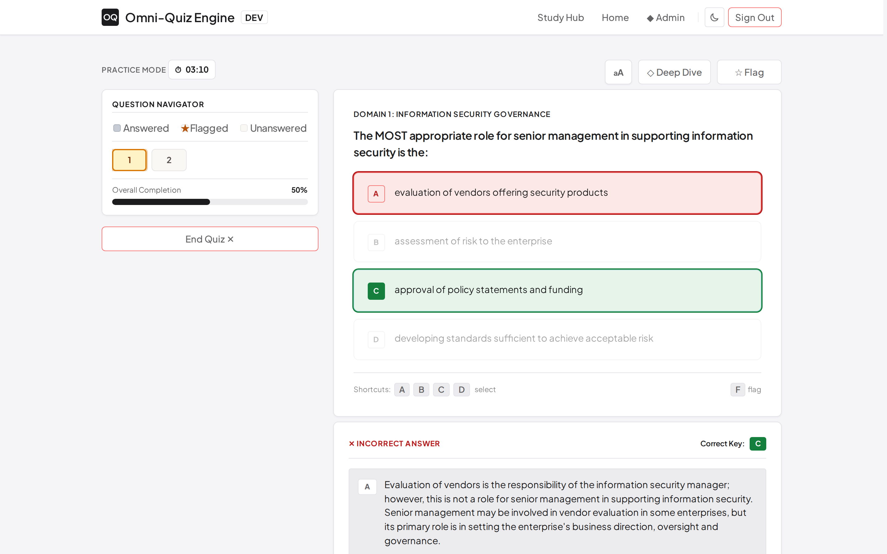
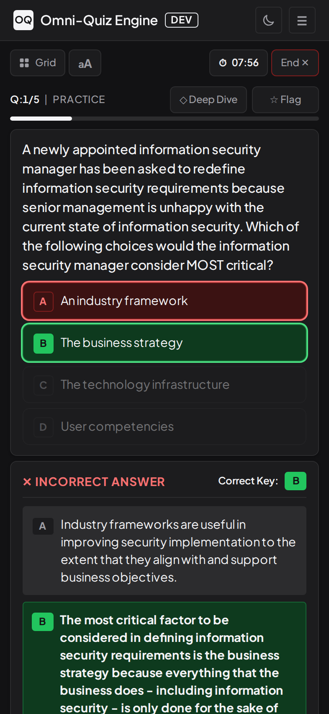
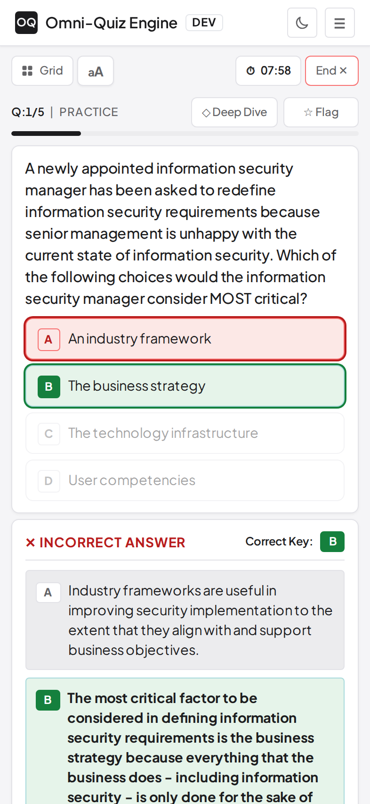
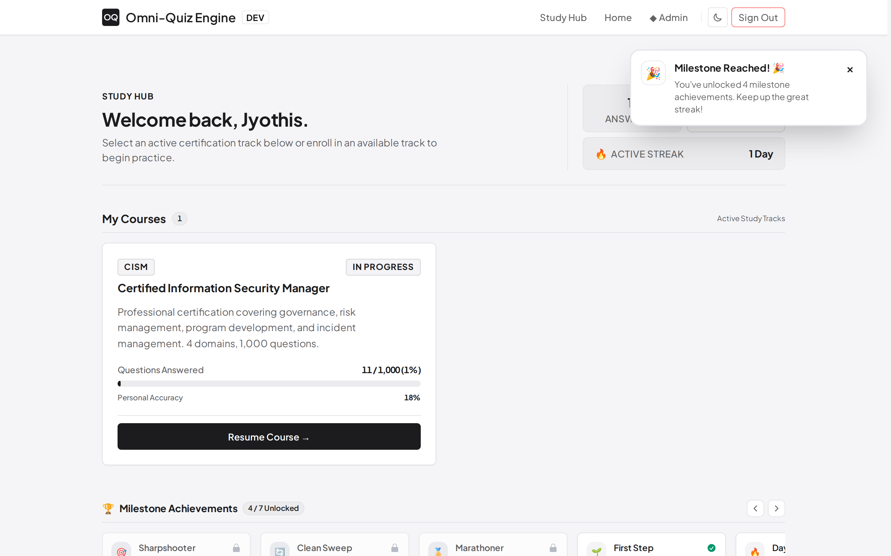
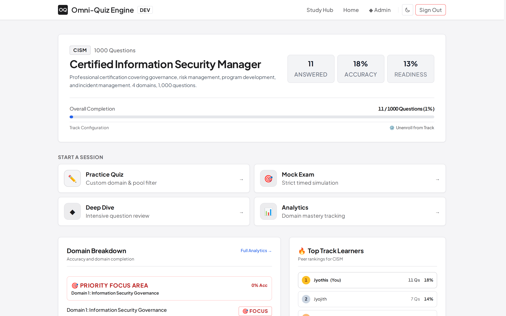
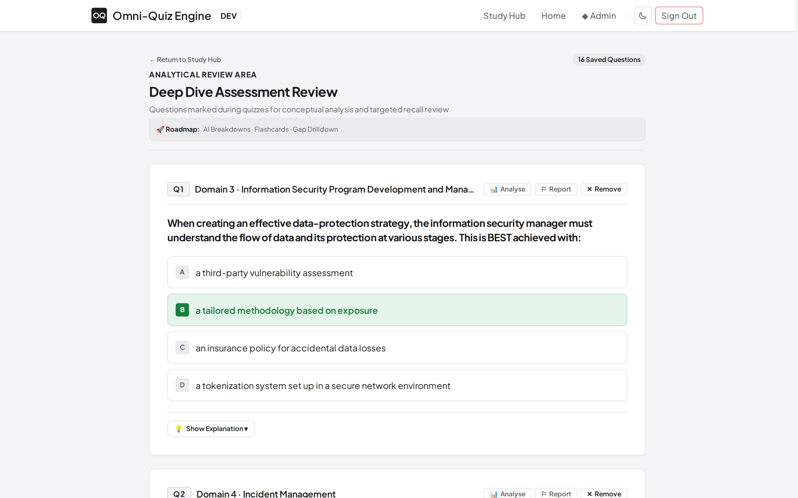
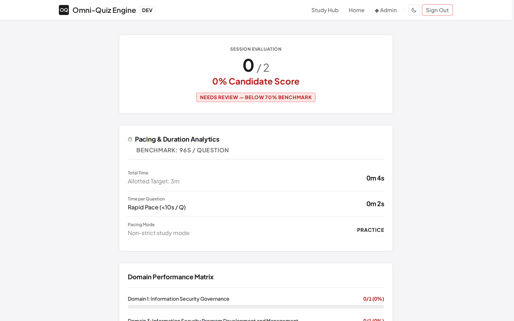
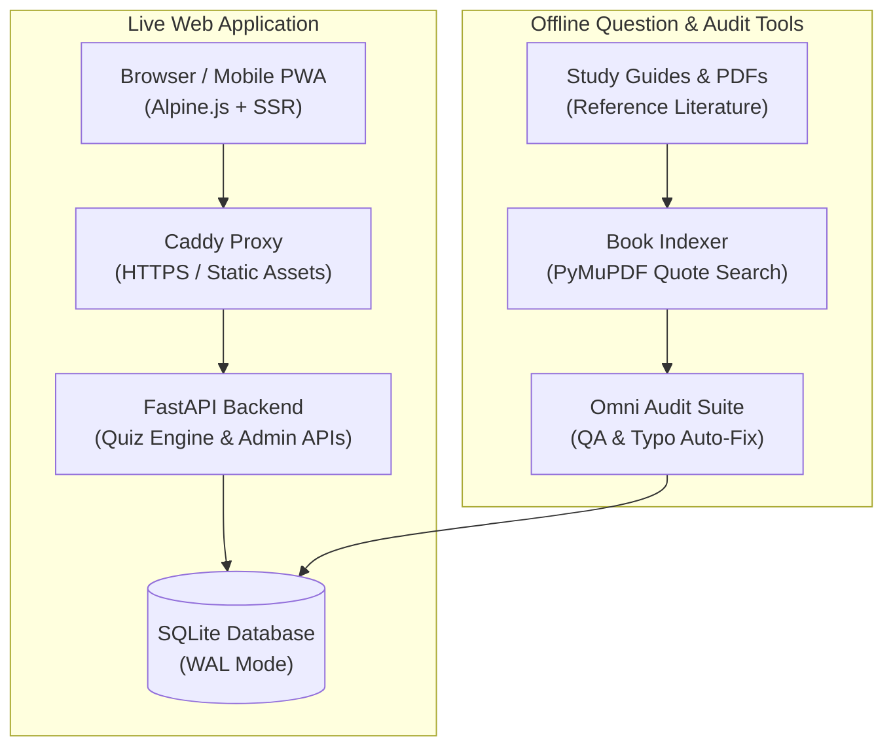

# Omni-Quiz Engine

<div align="center">


**A lightweight, realistic exam simulation platform built for professional certification practice.**

[Overview](#-product-overview) • [Interface Showcase](#-platform-interface-showcase) • [Candidate Features](#-core-candidate-features) • [Admin & Management Tools](#-admin--management-tools) • [System Architecture & Tech Stack](#-system-architecture--technology-stack) • [Question Auditing & Book References](#-question-auditing-book-references--explanation-pipeline) • [Data Contract & Samples](#-data-contract--sample-datasets) • [Mission & Vision](#-mission--vision)

</div>

---

## 🧭 Product Overview

**Omni-Quiz Engine** is an exam simulation and study platform designed to prepare candidates for computer-based tests, especially IT certification exams.

Traditional study methods like static flashcards and notes are great for quick review, but they don't prepare you for the time limits, navigation and pressure of a real testing environment. Omni-Quiz bridges this gap by combining authentic exam screens, detailed answer breakdowns and speed tracking in one place.

### What You Can Do
* **Practice Like the Real Exam**: Take timed mock tests with question flags, review grids and quick keyboard shortcuts (`A`, `B`, `C`, `D`, `F`).
* **Learn from Every Answer**: Read clear explanations for why the right answer is correct and why every wrong choice is wrong, with textbook page references.
* **Fix Your Weak Spots**: Automatically save missed questions to a review list that brings them back until you master them.
* **Track Speed and Accuracy**: See how many seconds you spend on each question and check your score by topic.
* **Study on Any Device**: Works seamlessly on phone, tablet or desktop with dark and light modes.
* **Manage Questions and Users**: Edit questions in your browser, import/export CSV files and share custom invite codes.

---

## 📸 Platform Interface Showcase

### 1. Realistic Exam Screen (Desktop)
*Exam simulation with question navigation, timer, flag-for-review and instant answer rationales.*

<div align="center">
  
</div>

---

### 2. Mobile Responsive & PWA Experience
*Touch-optimized quiz interface with native dark and light theme support.*

<div align="center">
  <table>
    <tr>
      <td align="center" width="50%">
        <strong>Dark Theme</strong><br/><br/>
        
      </td>
      <td align="center" width="50%">
        <strong>Light Theme</strong><br/><br/>
        
      </td>
    </tr>
  </table>
</div>

---

### 3. Multi-Course Catalog & Milestones
*Course selection, progress tracking and achievement milestones.*

<div align="center">
  
</div>

---

### 4. Performance Dashboard & Analytics
*Domain-by-domain accuracy breakdowns, readiness scores and attempt history.*

<div align="center">
  
</div>

---

### 5. Deep Dive Review Queue
*Saved questions list for focused review of complex concepts and incorrect answers.*

<div align="center">
  
</div>

---

### 6. Quiz Summary & Pacing Metrics
*End-of-quiz score summary, domain performance breakdown and time spent per question.*

<div align="center">
  
</div>

---

## 💎 Core Candidate Features

### 1. Practice & Mock Exam Modes
* **Practice Mode**: Get immediate feedback after answering each question, with full explanations showing why the right answer is correct and why each wrong choice is incorrect.
* **Mock Exam Mode**: Simulates the real test experience with timed countdowns, unrevealed answers until submission, full question review grids and an end-of-test performance breakdown.

### 2. Realistic Exam Screen & Controls
* **Realistic Countdown Timer**: Matches the pacing and time constraints of official exams.
* **Flag for Review**: Easily flag tricky questions, see an overview of answered vs. unanswered items and jump straight to flagged questions before submitting.
* **Full Keyboard Shortcuts**: Rapid option selection (`A`, `B`, `C`, `D`), flagging (`F`) and advancing (`Enter` / `Space`) for fast keyboard-only study sessions.
* **Clean, Focused Design**: High-contrast, distraction-free screen calibrated for extended multi-hour study sessions without eye strain.

### 3. Resumable Quiz Sessions
* **Persistent Session State**: Active quiz progress is saved automatically to the database, recording your question order, elapsed time and answers.
* **Interruption Recovery**: Multi-hour mock exams can be paused, closed and resumed across browser refreshes, tab closures or device switches without losing progress.

### 4. Pacing & Accuracy Metrics
* **Time Spent Per Question**: Tracks exactly how many seconds you spend on each question to highlight where you get stuck.
* **Domain Breakdown**: Calculates your accuracy across individual exam topics and domains in real time.
* **Readiness Score**: Estimates your exam readiness based on recent attempts, question difficulty and domain coverage.

### 5. Targeted Weak-Spot Training & Spaced Repetition
* **Automatic Error Quarantine**: Incorrect answers are automatically saved to your "Deep Dive" review list.
* **Smart Spaced Repetition**: Missed questions reappear across spaced study intervals until you answer them correctly multiple times.
* **Custom Practice Sets**: Generate quick drills focused exclusively on your weakest topics.

### 6. Achievement Badges & Milestones
* **Mastery Milestones**: Earn badges (e.g., *Sharpshooter*, *Clean Sweep*, *Marathoner*, *Explorer*) as you complete quizzes and improve accuracy.
* **Interactive Trophy Carousel**: Smooth swipeable badge showcase with celebration animations and progress indicators.

### 7. Multi-Course Support
* **Add New Courses Instantly**: Any new exam, subject or question bank can be loaded into the platform without database code changes.
* **Topic Taxonomy**: Group questions by official domains and subtopics for custom practice sessions.

### 8. Clear 4-Option Explanations
* **Explanations for Every Choice**: Every question explains not only why the correct answer is right, but also why each wrong option doesn't fit the scenario.
* **Direct Textbook Citations**: Explanations link directly to official study guides with exact chapter and page references.

### 9. Mobile & PWA Support
* **Installable App (PWA)**: Install Omni-Quiz as a standalone app on your phone or tablet with home-screen launch and fast offline asset caching.
* **Touch-Friendly Controls**: Responsive bottom-sheet question drawers and tap-friendly buttons.
* **Dark & Light Themes**: Easy one-click theme switching for comfortable reading day or night.

### 10. Simple, Secure Authentication
* **Tamper-Proof Session Cookies**: Fast, secure login using cryptographically signed cookies (`itsdangerous` + `bcrypt`).
* **Isolated User Data**: Each candidate has private access to their own attempt histories, speed metrics and review lists.

### 11. Broadcast Announcement Banners
* **Banner Alerts**: Admins can broadcast sticky updates or study tips directly to the candidate portal.
* **Cross-Device Dismissal**: When you dismiss a banner on your phone, it stays dismissed on your desktop.

### 12. Safe Data Protection
* **Anti-Scraping Protection**: Questions and answer keys are served dynamically per question, preventing automated client-side data dumps.
* **Private & Self-Contained**: 100% self-hosted with zero third-party tracking scripts, analytics cookies or external surveillance probes.

---

## 🛠️ Admin & Management Tools

Omni-Quiz includes a complete suite of administrative and operational tools for managing curriculum, users and deployments without manual database hacking:

### 1. Interactive Question Bank Studio (`/admin/questions`)
* **Multi-Course & Domain Filters**: Instantly filter questions by course track and knowledge domain.
* **Single-Record Live Editor**: Rapid next/previous navigation through questions with live in-browser editing of question stems, choices (A, B, C, D), correct answer keys and full explanations.
* **Live Markdown Preview**: Real-time rendering of formatted option breakdowns, lists and citations as you type.
* **Bulk CSV & JSON Import/Export**: One-click export of filtered or full question banks to standard CSV/JSON and upload ingestion with validation checks.

### 2. Safe Dev-to-Prod Synchronization
* **Isolated Staging Workflow**: All question edits and structural fixes are made safely in the Development environment (`APP_ENV=development`).
* **One-Click Production Sync**: The admin studio includes a guarded `/sync-prod` pipeline that automatically:
  1. Creates a timestamped SQLite WAL backup before any changes are written.
  2. Runs a dry-run schema validation check.
  3. Copies audited question records cleanly into the production database.
  4. Triggers a zero-downtime service reload without interrupting active candidate exam sessions.

### 3. Dynamic Invite Code & Access Manager (`/admin/invites`)
* **Custom Code Generation**: Generate clean alphanumeric invite codes with custom usage limits (single-use or multi-user).
* **Expiration Timers**: Set time-based validity windows (e.g., 7-day or 30-day access passes).
* **Instant Activation Control**: Toggle codes active/inactive on the fly to grant or revoke access instantly.
* **Redemption Audit Trail**: View real-time redemption logs showing which candidates used which invite code and when.

### 4. Broadcast Announcements & Alert Dispatcher
* **Global & Course Banners**: Publish sticky announcements or dismissible alerts directly to candidate portals.
* **Read State Sync**: User dismissals are synced across devices via database tracking so candidates never see duplicate alerts.

### 5. DevOps Automation & Health Diagnostics
* **Automated WAL Backups (`backup.py`)**: Scheduled SQLite backups with WAL checkpoints and retention rotation.
* **Point-in-Time Restore (`restore.py`)**: Automated verification and rollback to previous database snapshots.
* **System Health Inspector (`verify_services.py`)**: Quick health probes checking Caddy reverse proxy, Dev server and Prod server status.

---

## 🏗️ System Architecture & Technology Stack

### Component Architecture



---

### Technology Stack & Specifications

Omni-Quiz is built with a lightweight, high-performance tech stack designed for sub-millisecond response times, zero build-step overhead and simple maintenance:

| Layer | Technology | Role & Key Features |
| :--- | :--- | :--- |
| **Backend Framework** | **FastAPI** (Python 3.12) | Asynchronous REST routing, modular endpoints and high-speed JSON serialization. |
| **ASGI Server** | **Uvicorn** | High-concurrency asynchronous server gateway interface. |
| **Reverse Proxy** | **Caddy** | Automatic HTTPS, HTTP/2 & HTTP/3 termination, Gzip/Zstandard compression and static asset caching. |
| **Data Persistence** | **SQLite 3 (WAL Mode)** | Local-first relational database with Write-Ahead Logging (`PRAGMA journal_mode=WAL`) for concurrent reads and writes without lock contention. |
| **Session State** | **UUID Resumable Sessions** | Server-persisted session matrices recording randomized questions, answered keys and timers. |
| **Frontend Templates** | **Jinja2 (SSR)** | Server-side rendered templates for instant initial page paints with zero layout shift. |
| **Client Reactivity** | **Alpine.js** | Minimalist declarative reactivity handling interactive modals, dropdowns, timer ticks and keyboard navigation. |
| **Styling & Tokens** | **Tailwind CSS & Vanilla CSS** | Custom responsive design tokens with native dark/light theme switching and mobile touch drawers. |
| **Mobile & PWA Engine** | **Service Worker & Manifest** | Standalone installable PWA with offline UI asset caching and responsive home-screen launch. |
| **Security & Auth** | **`itsdangerous` + `bcrypt`** | Cryptographically signed, tamper-proof session cookies for stateless authentication paired with salted PIN hashing. |
| **Document Processing** | **PyMuPDF (`fitz`)** | High-speed PDF text parsing and textbook search indexing for automated citation generation. |
| **Testing Harness** | **Pytest & Playwright** | Comprehensive automated test coverage spanning unit tests, API routes and browser UI simulations. |

---

## 🔍 Question Auditing, Book References & Explanation Pipeline

Omni-Quiz incorporates specialized offline automation scripts to ensure that all question banks meet strict quality standards, contain zero OCR scan errors and provide authoritative textbook citations:

### 1. Unified Question Bank Audit Suite (`omni_audit_suite.py`)
A comprehensive database quality assurance tool that scans and automatically cleans question records:
* **Structural & Schema Integrity**: Ensures question stems meet minimum length requirements ($\ge 15$ characters), all 4 answer options (A, B, C, D) are populated and correct answer keys are valid.
* **Automated OCR Ligature & Typo Repair**: Fixes scanning errors from digitized source books (e.g. `difÏcult` $\to$ `difficult`, `ofÏce` $\to$ `office`, `secirity` $\to$ `security`, `govemance` $\to$ `governance`).
* **Typography Standardization**: Cleans non-standard control characters (`\xa0`, `\u200b`), fixes smart quotes and standardizes punctuation spacing (e.g. `risk.The` $\to$ `risk. The`).
* **Cybersecurity & IT Terminology Whitelist**: Audits words against a comprehensive technical dictionary covering certifications, standards and metrics (ISACA, ISC2, NIST, COBIT, CIA triad, SIEM, SOC, RTO/RPO, BIA, etc.) to flag genuine spelling issues.
* **Distractor Length Calibration**: Analyzes answer choice lengths to identify questions where the correct answer is noticeably longer or shorter than the distractors, preventing giveaway answers.

### 2. Book Reference Search & Citation Indexer (`build_book_index.py`, `deep_enrich_quotes.py`)
To ensure explanations are grounded in authoritative source literature, the platform uses a book indexing and citation pipeline:
* **Textbook Full-Text Indexing**: Uses PyMuPDF to extract and index page-by-page text from official study guides (e.g., Mike Chapple *CC Study Guide*, Steven Bennett *CC All-in-One Exam Guide* and official ISACA review manuals).
* **Automated Keyword & Concept Matching**: Analyzes the question stem and correct answer choice to search the textbook index for the exact relevant section.
* **Substantive Quote Extraction**: Automatically pulls the defining paragraph and chapter reference from the textbook and embeds the exact quote and page number into the question's explanation field.

### 3. Structured 4-Option Explanation Builder (`deep_educational_explanations.py`)
Every question explanation follows a clean 3-part educational structure:
1. **Core Concept & Scenario Rationale**: Explains directly why the correct answer solves the problem presented in the question stem.
2. **Official Exam Guide Citation**: Cites the textbook title, chapter topic, page number and direct textbook quote.
3. **Granular Distractor Analysis**: Explicitly details why each incorrect option (A, B, C or D) is wrong, explaining whether it applies to a different layer, an unrelated security concept or a different administrative role.

---

## 📦 Data Ingestion Architecture

Omni-Quiz Engine utilizes a standardized, modular data contract for curriculum and question bank ingestion. Subject matter experts and instructional designers can supply question datasets in either JSON or CSV format.

### Standard Question Data Contract

```typescript
interface QuizQuestion {
  id: number;                // Unique integer identifier
  course_id: number;         // Identifier for subject module
  domain: string;            // Official knowledge domain / topic category
  question_text: string;     // Question stem text (minimum 15 characters)
  option_a: string;          // Option Choice A
  option_b: string;          // Option Choice B
  option_c: string;          // Option Choice C
  option_d: string;          // Option Choice D
  correct_answer: "A" | "B" | "C" | "D"; // Verified correct answer key
  explanation: string;       // Comprehensive 4-option rationale breakdown
}
```

---

## 🎯 Mission & Vision

> **The Mission**: To provide a clean, fast and open platform for exam prep, allowing candidates to practice with realistic test conditions and high-quality study materials without artificial paywalls.
> 
> **The Vision**: To combine realistic exam timing, thorough answer explanations and smart review queues into a simple, high-impact study tool.

---

## 📑 Templates & Sample Datasets

Reference the standardized ingestion schemas and generic demonstration datasets included in this package:

* **JSON Schema Specification**: [`templates/question_schema.json`](./templates/question_schema.json)
* **CSV Header Template**: [`templates/question_schema.csv`](./templates/question_schema.csv)
* **Generic Sample Questions (JSON)**: [`samples/sample_questions.json`](./samples/sample_questions.json)
* **Generic Sample Questions (CSV)**: [`samples/sample_questions.csv`](./samples/sample_questions.csv)

---

<div align="center">
  <sub>Omni-Quiz Engine • Enterprise Examination Simulation & Mastery Framework</sub>
</div>
