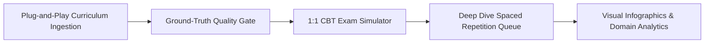
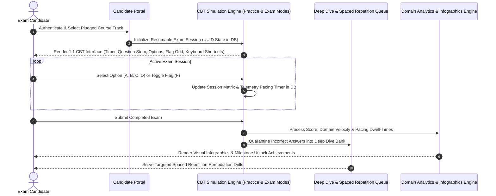
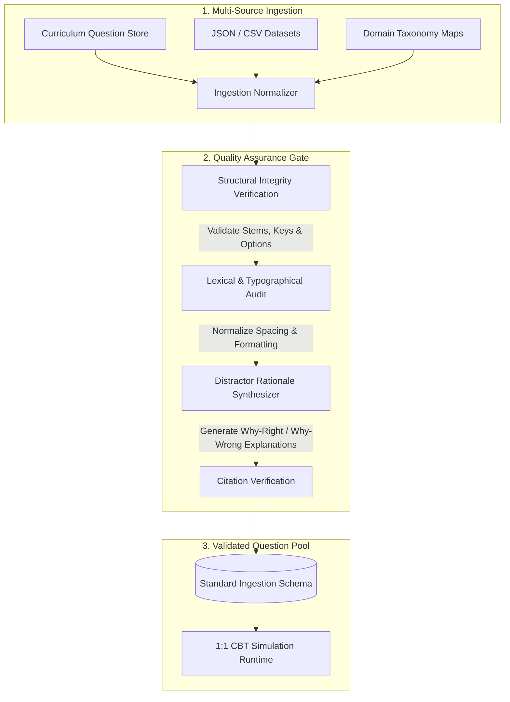

# Omni-Quiz Engine

<div align="center">


**An enterprise-grade examination simulation and active mastery framework engineered for high-stakes professional testing.**

[Overview](#-product-overview) • [Mission & Vision](#-mission--vision) • [Interface Showcase](#-platform-interface-showcase) • [Core Capabilities](#-core-capabilities) • [Architecture & Workflows](#-system-architecture--workflows) • [Technology Stack](#-technology-stack--architecture) • [Templates & Samples](#-templates--sample-datasets)

</div>

---

## 🎯 Mission & Vision

> **The Mission**: To replace restrictive, high-cost testing platforms with a robust, open-architecture examination framework. This empowers candidates to train on rigorous, validated simulation materials without artificial barriers.
> 
> **The Vision**: To bridge the gap between static study workflows and real test-day execution by combining 1:1 Computer-Based Testing (CBT) simulation, deep distractor analysis, and adaptive spaced repetition into a unified, high-mastery framework.

---

## 🧭 Product Overview

**Omni-Quiz Engine** is an advanced examination simulation framework designed to optimize candidate readiness, pacing, and conceptual retention for high-stakes professional certifications.

Traditional study workflows rely heavily on static flashcards and basic review notes, which are excellent for active recall but often fail to replicate the psychological pressure, strict timing, and multi-domain navigation demands of real testing environments. Omni-Quiz Engine bridges this gap by pairing proven study methods with authentic Computer-Based Testing (CBT) interfaces, rigorous distractor analysis, and real-time pacing diagnostics.



---

## 📸 Platform Interface Showcase

### 1. 1:1 CBT Simulation (Desktop)
*Exam simulation with question navigation, timer, flag-for-review, and instant answer rationales.*

<div align="center">
  
</div>

---

### 2. Mobile Responsive & PWA Experience
*Touch-optimized quiz interface with native dark and light theme support.*

<div align="center">
  <table>
    <tr>
      <td align="center" width="50%">
        <strong>Dark Theme</strong><br/><br/>
        
      </td>
      <td align="center" width="50%">
        <strong>Light Theme</strong><br/><br/>
        
      </td>
    </tr>
  </table>
</div>

---

### 3. Multi-Course Catalog & Milestones
*Course selection, progress tracking, and achievement milestones.*

<div align="center">
  
</div>

---

### 4. Performance Dashboard & Analytics
*Domain-by-domain accuracy breakdowns, readiness scores, and attempt history.*

<div align="center">
  
</div>

---

### 5. Deep Dive Review Queue
*Saved questions list for focused review of complex concepts and incorrect answers.*

<div align="center">
  
</div>

---

### 6. Quiz Summary & Pacing Metrics
*End-of-quiz score summary, domain performance breakdown, and time spent per question.*

<div align="center">
  
</div>

---

## 💎 Core Capabilities

### 1. Dual Simulation Modes (Practice vs. Exam)
* **Formative Practice Mode**: Instant, per-question feedback with locked options and immediate distractor rationale reveals for rapid conceptual reinforcement.
* **Summative CBT Exam Mode**: Full proctored exam simulation with deferred grading, unrevealed answers, question navigation grids, and a comprehensive diagnostic debriefing.

### 2. High-Fidelity 1:1 CBT Simulation
* **Psychometric Exam Calibration**: Replicates the exact timing constraints, section pacing, and navigation paradigms used in standardized testing centers.
* **Flag-for-Review Triaging**: Real-time split-panel question matrix allowing candidates to tag ambiguous items, monitor completion status, and execute targeted end-of-section reviews under time pressure.
* **High-Efficiency Keyboard Navigation**: Full keyboard shortcut integration (`A`, `B`, `C`, `D` for rapid option selection, `F` for flagging items, `Enter` / `Space` to advance) for high-speed drill sessions and accessibility (a11y).
* **Cognitive Load Optimization**: High-contrast, distraction-free interface calibrated for extended multi-hour examination marathons without visual fatigue.

### 3. Database-Backed Resumable Quiz Sessions
* **Persistent Exam Runtime**: Active quiz state is stored server-side in a dedicated `QuizSessions` table keyed by UUID, recording the randomized question sequence and accumulative answer map.
* **Interruption Recovery**: Multi-hour mock exams can be paused, exited, and resumed seamlessly across network drops, tab closures, and device transitions without losing timer state or answers.

### 4. Question Pacing & Accuracy Metrics Telemetry
* **Millisecond-Level Dwell Time**: Tracks per-question response velocity and dwell time to diagnose speed bottlenecks and time-management risks.
* **Sub-Domain Precision**: Real-time accuracy and velocity metrics computed across individual knowledge domains and competency areas.
* **Readiness Probability Index**: Weighted predictive scoring models evaluating attempt recency, domain distribution, and difficulty weighting to calculate true exam readiness.

### 5. Targeted Weak-Spot Training & Spaced Repetition
* **Automated Error Quarantine**: Incorrect answers are automatically routed into an isolated "Deep Dive" remediation queue.
* **Active Spaced Repetition (SRS)**: Flagged and missed concepts resurface across calculated intervals until the candidate demonstrates repeated, unassisted mastery.
* **Focused Remediation Drills**: Candidates can generate targeted review sessions centered strictly on conceptual weak areas to accelerate competency growth.

### 6. Milestone Gamification & Achievement Framework
* **Tiered Mastery Milestones**: Dynamic achievement engine (e.g., *Sharpshooter*, *Clean Sweep*, *Marathoner*, *Explorer*) incentivizing study consistency and milestone progression.
* **Interactive Touch Carousel**: Responsive achievement carousel with native CSS touch scroll-snapping, SVG status indicators, celebratory confetti particles, and high-contrast toast notifications.

### 7. Plug-and-Play Multi-Course Architecture
* **Extensible Course Ingestion**: Any new subject track, professional certification, or domain question bank can be plugged into the platform instantly without database schema migrations.
* **Modular Question Taxonomy**: Supports multi-domain hierarchies, weighted competency areas, and configurable exam simulation presets.
* **Ground-Truth Quality Gates**: Structured auditing pipeline normalizes formatting, cleans question stems, and validates distractor balance across all ingested courses.

### 8. Structured Distractor Analysis
* **Comprehensive 4-Option Breakdowns**: Every question delivers thorough pedagogical rationales detailing why the correct choice is accurate and breaking down the specific conceptual fallacy behind each distractor choice.
* **Citation-Backed Verification**: Links rationales directly to authoritative body-of-knowledge standards and domain literature references.

### 9. Mobile-First Optimization & PWA App
* **Progressive Web App (PWA)**: Installable standalone application experience on mobile and tablet devices with client UI asset caching and responsive home-screen launch.
* **Touch-Optimized Interaction**: Native mobile touch scroll-snapping, responsive bottom-sheet review drawers, and tactile answer feedback.
* **Adaptive Ambient Lighting**: Seamless, high-contrast dark and light surface adaptation for comfortable study in any lighting condition.

### 10. Stateless Cryptographic Authentication & Tenant Isolation
* **Stateless Signed Cookie Auth**: Request authentication relies on tamper-proof, cryptographically signed HTTP-only cookies (`itsdangerous` / token claims + `bcrypt`), eliminating database lookup overhead on general HTTP requests.
* **Strict Tenant Segregation**: Complete per-candidate data segregation tracking comprehensive attempt histories, speed metrics, and topic mastery.

### 11. Enterprise Announcement & Broadcast Queue
* **Cross-Device Read Tracking**: Relational database-backed broadcast announcements with multi-device synchronization, ensuring zero missed updates.
* **Priority Alert Delivery**: Supports priority sticky alerts, timed auto-dismiss progress bars, and single-toast-per-page load orchestration.

### 12. Security-by-Design & Anti-Extraction Architecture
* **Zero Mass Data Extraction**: Dynamic question streaming and server-validated answer keys prevent client-side bulk data dumps, DOM scraping, or automated curriculum harvesting.
* **Zero-Trust Access & Rate Limiting**: Hardened session validation and rate-limiting boundaries ensure that examination materials are served strictly within authorized, active simulation flows.
* **Local Data Residency & Sovereignty**: Local-first architecture engineered with zero third-party tracking pixels, external telemetry probes, or surveillance SDKs, guaranteeing complete institutional and candidate privacy.

---

## 🏗️ System Architecture & Workflows

### Candidate Simulation & Remediation Lifecycle



---

### Question Ingestion & Quality Gate



---

## 🛠️ Technology Stack & Architecture

Omni-Quiz Engine is architected with a lightweight, high-performance tech stack engineered for sub-millisecond response times, zero build-step overhead, and maximum runtime reliability:

| Layer | Technology | Architectural Role & Implementation |
| :--- | :--- | :--- |
| **Backend Framework** | **FastAPI** (Python 3.12) | High-performance asynchronous REST API handling examination state, routing, and scoring logic. |
| **ASGI Web Server** | **Uvicorn** | Lightning-fast asynchronous server gateway interface supporting concurrent client connections. |
| **Schema Validation** | **Pydantic v2** | High-speed data model serialization, strict request sanitization, and input boundary validation. |
| **Data Persistence** | **SQLite 3 (WAL Mode)** | Local-first relational database operating in Write-Ahead Logging (`PRAGMA journal_mode=WAL`) mode for high-concurrency ACID transactions, persisting user records, quiz sessions, and question banks. |
| **Frontend Rendering** | **Jinja2 (SSR)** | Server-Side Rendered templates delivering instant initial page paints and zero-FOUC (Flash of Unstyled Content) layouts. |
| **Client Reactivity** | **Alpine.js** | Lightweight declarative reactivity engine managing client-side interactive state, dropdowns, keyboard events, and modal drawers. |
| **Styling & Design System** | **Tailwind CSS & Vanilla CSS** | Bespoke high-contrast editorial design tokens with dark/light ambient adaptation, responsive layouts, and tactile touch states. |
| **Mobile & PWA Engine** | **Service Worker & Web Manifest** | Root-scoped Service Worker (`sw.js`) caching static UI assets (CSS, JS, fonts) for sub-second page transitions and standalone home-screen mobile display. |
| **Security & Auth Layer** | **`itsdangerous` + `bcrypt`** | Cryptographically signed, tamper-proof session cookies (`URLSafeTimedSerializer`) for stateless request authentication paired with salted password/PIN hashing. |
| **Quality & Test Harness** | **Pytest & Playwright** | Comprehensive automated test suite spanning unit test cases, API integration tests, and headless browser UI validations. |

---

## 📦 Data Ingestion Architecture

Omni-Quiz Engine utilizes a standardized, modular data contract for curriculum and question bank ingestion. Subject matter experts and instructional designers can supply question datasets in either JSON or CSV format.

### Standard Question Data Contract

```typescript
interface QuizQuestion {
  id: number;                // Unique integer identifier
  course_id: number;         // Identifier for subject module
  domain: string;            // Official knowledge domain / topic category
  question_text: string;     // Question stem text (minimum 15 characters)
  option_a: string;          // Option Choice A
  option_b: string;          // Option Choice B
  option_c: string;          // Option Choice C
  option_d: string;          // Option Choice D
  correct_answer: "A" | "B" | "C" | "D"; // Verified correct answer key
  explanation: string;       // Comprehensive 4-option rationale breakdown
}
```

---

## 📑 Templates & Sample Datasets

Reference the standardized ingestion schemas and generic demonstration datasets included in this package:

* **JSON Schema Specification**: [`templates/question_schema.json`](./templates/question_schema.json)
* **CSV Header Template**: [`templates/question_schema.csv`](./templates/question_schema.csv)
* **Generic Sample Questions (JSON)**: [`samples/sample_questions.json`](./samples/sample_questions.json)
* **Generic Sample Questions (CSV)**: [`samples/sample_questions.csv`](./samples/sample_questions.csv)

---

<div align="center">
  <sub>Omni-Quiz Engine • Enterprise Examination Simulation & Mastery Framework</sub>
</div>
