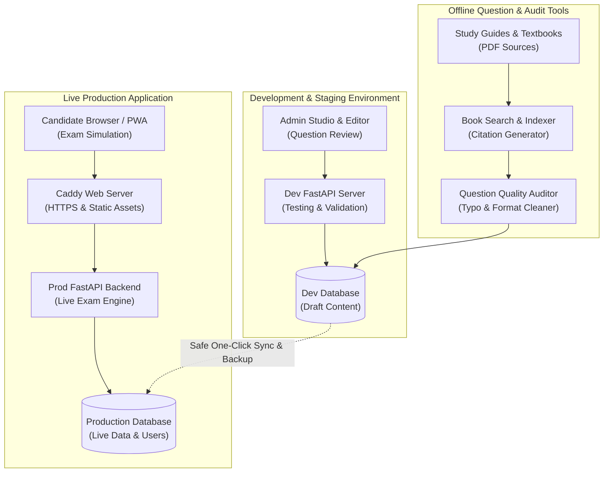

# Omni-Quiz Engine

<div align="center">


**A lightweight, realistic exam simulation platform built for professional certification practice.**

[Overview](#-product-overview) • [Core Features](#-core-platform-features) • [Interface Showcase](#-platform-interface-showcase) • [System Architecture & Tech Stack](#-system-architecture--technology-stack) • [Question Auditing & Book References](#-question-auditing-book-references--explanation-pipeline) • [Data Contract & Samples](#-data-contract--sample-datasets) • [Mission & Vision](#-mission--vision)

</div>

---

## 🧭 Product Overview

**Omni-Quiz Engine** is an exam simulation and study platform designed to prepare candidates for computer-based tests, especially IT certification exams.

Traditional study tools like static flashcards don't prepare you for real testing pressure. Omni-Quiz bridges this gap with authentic exam screens, detailed answer breakdowns, and speed tracking in one place.

---

## 💎 Core Platform Features

### 1. Exam & Quiz Simulation
* **Dual Quiz Modes**: Practice mode with instant feedback or full timed mock exams with answers hidden until submission.
* **Realistic Controls**: Countdown timer, question grid and navigation with keyboard shortcuts.
* **Resumable Exams**: Progress is automatically saved so you can pause and resume multi-hour tests anytime.
* **Detailed Explanations**: Learn why correct answers work and why wrong choices fail, backed by textbook references.
* **Smart Review Queue**: Missed questions are saved to a "Deep Dive" list and resurfaced until mastered. Flag questions for review during the test.

### 2. Performance & Pacing Analytics
* **Per-Question Time Tracking**: Tracks exact seconds spent on each question to identify speed bottlenecks and pacing risks.
* **Domain Accuracy & Readiness**: Computes accuracy across individual exam topics and calculates overall exam readiness scores.

### 3. Mobile & PWA Experience
* **Installable App**: Works as a standalone Progressive Web App on phones and tablets with home-screen launch and offline asset caching.
* **Mobile screen optimized**: Clean layouts with smooth tap controls and dark/light theme switching. 

### 4. Administration & Content Management
* **In-Browser Question Studio**: Browse and edit questions content with live preview.
* **Safe Staging-to-Production Sync**: Test content updates in staging before pushing to production with automatic backups. 
* **Bulk Import & Export**: Easily upload or export question banks using CSV and JSON files.
* **Invite Code Access Control**: Generate custom invite codes with usage limits and expiration dates.

---

## 📸 Platform Interface Showcase

### 1. Realistic Exam Screen (Desktop)
*Exam simulation with question navigation, timer, flag-for-review and instant answer rationales.*

<div align="center">
  
</div>

---

### 2. Mobile Responsive & PWA Experience
*Touch-optimized quiz interface with native dark and light theme support.*

<div align="center">
  <table>
    <tr>
      <td align="center" width="50%">
        <strong>Dark Theme</strong><br/><br/>
        
      </td>
      <td align="center" width="50%">
        <strong>Light Theme</strong><br/><br/>
        
      </td>
    </tr>
  </table>
</div>

---

### 3. Multi-Course Catalog & Milestones
*Course selection, progress tracking and achievement milestones.*

<div align="center">
  
</div>

---

### 4. Performance Dashboard & Analytics
*Domain-by-domain accuracy breakdowns, readiness scores and attempt history.*

<div align="center">
  
</div>

---

### 5. Deep Dive Review Queue
*Saved questions list for focused review of complex concepts and incorrect answers.*

<div align="center">
  
</div>

---

### 6. Quiz Summary & Pacing Metrics
*End-of-quiz score summary, domain performance breakdown and time spent per question.*

<div align="center">
  
</div>

---

## 🏗️ System Architecture & Technology Stack



---

### Technology Stack & Specifications

Omni-Quiz is built with a lightweight, high-performance tech stack designed for fast response times and zero setup headaches:

| Layer | Technology | Role & Key Features |
| :--- | :--- | :--- |
| **Backend Framework** | **FastAPI** (Python 3.12) | High-speed API powering quiz simulation, scoring and admin management. |
| **ASGI Server** | **Uvicorn** | Fast asynchronous web server. |
| **Web Server / Proxy** | **Caddy** | Automatic HTTPS, modern HTTP/3 compression and static file caching. |
| **Data Persistence** | **SQLite 3** | Lightweight database storing questions, exam sessions and candidate progress. |
| **Session State** | **Resumable Sessions** | Saves question order, timers and answers so tests can be resumed anytime. |
| **Frontend Templates** | **Jinja2 (SSR)** | Server-side rendered pages for instant loading. |
| **Client Reactivity** | **Alpine.js** | Lightweight interactivity for modals, dropdowns, timers and keyboard shortcuts. |
| **Styling & Design** | **Tailwind CSS & Vanilla CSS** | Clean design with dark/light themes and mobile touch controls. |
| **Mobile App** | **Progressive Web App (PWA)** | Installable on phone or tablet with home-screen launch and offline asset caching. |
| **Security & Auth** | **Signed Session Cookies** | Secure, tamper-proof session cookies and salted password protection. |
| **PDF Processing** | **PyMuPDF (`fitz`)** | Fast textbook search and page indexing for automated citations. |
| **Automated Testing** | **Pytest & Playwright** | Complete automated test suite covering backend logic and UI interactions. |

---

## 🔍 Question Auditing, Book References & Explanation Pipeline

Omni-Quiz incorporates specialized offline automation scripts to ensure that all question banks meet strict quality standards, contain zero OCR scan errors and provide authoritative textbook citations:

### 1. Automated Question Bank Quality Auditing
A comprehensive database quality assurance process that scans and automatically cleans question records:
* **Structural & Schema Integrity**: Ensures question stems meet minimum length requirements ($\ge 15$ characters), all 4 answer options (A, B, C, D) are populated and correct answer keys are valid.
* **Automated OCR Ligature & Typo Repair**: Fixes scanning errors from digitized source books (e.g. `difÏcult` $\to$ `difficult`, `ofÏce` $\to$ `office`, `configration` $\to$ `configuration`).
* **Typography Standardization**: Cleans non-standard control characters (`\xa0`, `\u200b`), fixes smart quotes and standardizes punctuation spacing (e.g. `system.The` $\to$ `system. The`).
* **IT & Technical Terminology Whitelist**: Audits words against a technical dictionary covering industry standards, protocols, architectures and acronyms to catch typos while preserving valid technical terms.
* **Distractor Length Calibration**: Analyzes answer choice lengths to identify questions where the correct answer is noticeably longer or shorter than the distractors, preventing giveaway answers.

### 2. Textbook Reference Search & Citation Indexing
To ensure explanations are grounded in authoritative source literature, the platform uses a book indexing and citation pipeline:
* **Textbook Full-Text Indexing**: Uses PyMuPDF to extract and index page-by-page text from official certification study guides and course textbooks.
* **Automated Keyword & Concept Matching**: Analyzes the question stem and correct answer choice to search the textbook index for the exact relevant section.
* **Substantive Quote Extraction**: Automatically pulls the defining paragraph and chapter reference from the textbook and embeds the exact quote and page number into the question's explanation field.

### 3. Structured 4-Option Explanation Pipeline
Every question explanation follows a clean 3-part educational structure:
1. **Core Concept & Scenario Rationale**: Explains directly why the correct answer solves the problem presented in the question stem.
2. **Official Exam Guide Citation**: Cites the textbook title, chapter topic, page number and direct textbook quote.
3. **Granular Distractor Analysis**: Explicitly details why each incorrect option (A, B, C or D) is wrong, explaining whether it applies to a different technical layer, an unrelated protocol or a different functional requirement.

---

## 📦 Data Ingestion Architecture

Omni-Quiz Engine utilizes a standardized, modular data contract for curriculum and question bank ingestion. Subject matter experts and instructional designers can supply question datasets in either JSON or CSV format.

### Standard Question Data Contract

```typescript
interface QuizQuestion {
  id: number;                // Unique integer identifier
  course_id: number;         // Identifier for subject module
  domain: string;            // Official knowledge domain / topic category
  question_text: string;     // Question stem text (minimum 15 characters)
  option_a: string;          // Option Choice A
  option_b: string;          // Option Choice B
  option_c: string;          // Option Choice C
  option_d: string;          // Option Choice D
  correct_answer: "A" | "B" | "C" | "D"; // Verified correct answer key
  explanation: string;       // Comprehensive 4-option rationale breakdown
}
```

---

## 📑 Templates & Sample Datasets

Reference the standardized ingestion schemas and generic demonstration datasets included in this package:

* **JSON Schema Specification**: [`templates/question_schema.json`](./templates/question_schema.json)
* **CSV Header Template**: [`templates/question_schema.csv`](./templates/question_schema.csv)
* **Generic Sample Questions (JSON)**: [`samples/sample_questions.json`](./samples/sample_questions.json)
* **Generic Sample Questions (CSV)**: [`samples/sample_questions.csv`](./samples/sample_questions.csv)

---

## 🎯 Mission & Vision

> **The Mission**: To provide a clean, fast and open platform for exam prep, allowing candidates to practice with realistic test conditions and high-quality study materials without artificial paywalls.
> 
> **The Vision**: To combine realistic exam timing, thorough answer explanations and smart review queues into a simple, high-impact study tool.

---

<div align="center">
  <sub>Omni-Quiz Engine • Enterprise Examination Simulation & Mastery Framework</sub>
</div>
